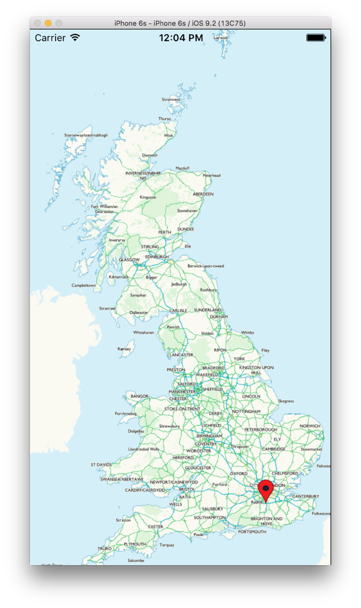

# OS WhirlyGlobe-Maply Adapter Framework

Framework for integration of WhirlyGlobe-Maply map SDK using Ordnance Survey mapping API.

Build: [](https://circleci.com/gh/OrdnanceSurvey/os-maply-adapter-ios) [](https://coveralls.io/github/OrdnanceSurvey/os-maply-adapter-ios?branch=master)

### Getting started

At the currently time of writing, WG-Maply does not yet support Carthage (see [Add Carthage support](https://github.com/mousebird/WhirlyGlobe/issues/542) issue in main WG-Maply repo). For this reason, manual building of the framework is required. 

Steps to do this are outlined below:

1. Clone this repo
2. Carthage update (this brings in OSTransformation framework): `$ carthage update --platform iOS --no-use-binaries `
3. Submodule init (this brings in WG-Maply): `$ git submodule update --init --recursive`
4. Open Xcode and build the `MaplyAdapter` framework. This will also build WG-Maply implicitly.

### Integration with your Xcode project:

1. Import the `MaplyAdapter` framework to your project.
2. Add `MaplyAdapter` and `OSTransformation` to 'link binary with libriaries' in xcode
3. Create embed frameworks build phase and add `MaplyAdapter` and `OSTransformation` to that.
4. Add Maply to your header search paths, e.g.:
`"$(SRCROOT)/../Submodules/WhirlyGlobeSrc/WhirlyGlobe-MaplyComponent/include"`
5. `@import MaplyAdapter;` in your view controller
6. Add `#import "MaplyComponent.h"` to your view controller
7. Create a mapView property:
```@property (nonatomic, strong) MaplyViewController *maplyViewController;```

8. Make your view controller conform to `<MaplyViewControllerDelegate>`

9. The map is created and added to the view hierarchy like this (example is for a BNG map):

	```
	- (MaplyViewController *)createMaplyViewController {
	    MaplyViewController *maplyViewController = [[MaplyViewController alloc] initWithMapType:MaplyMapTypeFlat];
	    maplyViewController.coordSys = [OSBNGUtils buildBritishNationalGrid];
	    maplyViewController.viewWrap = false;
	    maplyViewController.doubleTapZoomGesture = true;
	    maplyViewController.twoFingerTapGesture = true;
	    maplyViewController.cancelAnimationOnTouch = true;
	    maplyViewController.delegate = self;
	    return maplyViewController;
	}

	- (void)addMapToViewHierarchy {
	    [self.view addSubview:self.maplyViewController.view];
	    [self.view sendSubviewToBack:self.maplyViewController.view];
	    [self addChildViewController:self.maplyViewController];
	}
	```


10. Now, link against `libWhirlyGlobe-MaplyComponent.a`, and its associated framework deps:
	* `CoreLocation`
	* `libz`
	* `libc++`
	* `libxml2`
	* `libsqlite3`

11. Create the tile layer at the end of `viewDidLoad:` like so:

    ```
    MaplyQuadImageTilesLayer *tileLayer = [OSTileSourceFactory create27700TileLayer];
    [self.maplyViewController addLayer:tileLayer];
    ```
12. It's probably useful to set the initial map position to the centre of the country, do that like this:

    ```
    MaplyCoordinate centreOfGB = MaplyCoordinateMakeWithDegrees(-2.42, 54.83);
    MaplyCoordinate centreOfGBLocal = [self.maplyViewController.coordSys geoToLocal:centreOfGB];
    [self.maplyViewController setPosition:centreOfGBLocal height:1.7];
    ```


13. Place `APIKEY` file (containing your OS Maps API key) in the project root and include in your app bundle.
14. Run your app. If everything is configured correctly, you will see something similar to the below screenshot:


